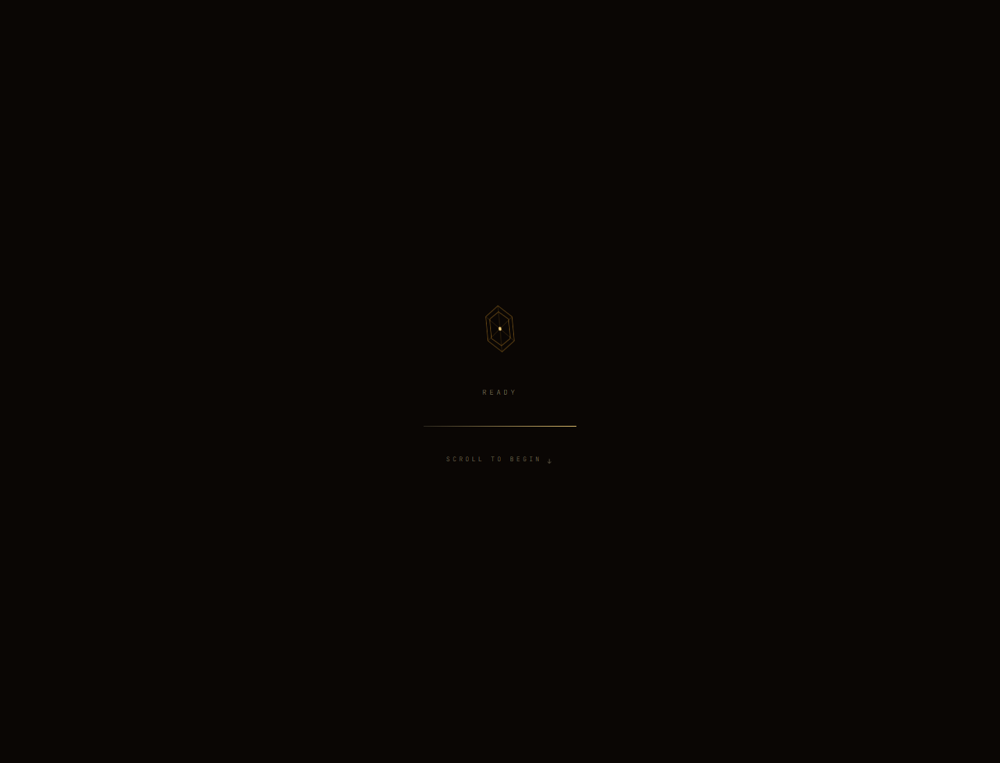

# 白日梦引擎 · Daydream Engine

> A mind in three acts. A realistic idealist who finished the math.

这是一个把个人思考做成可交互叙事的单页网站。它用“三幕剧”讲清楚一个现实派理想主义者如何拆解约束、成本和概率，再把白日梦推进到可以落地的下一步。



## 项目概览

- 作者：唐代喆 / TANG DAIZHE
- 形态：纯前端、单文件、零依赖
- 入口：`index.html`
- 视觉：暖色深空、扫描线、Canvas 场景和细微交互
- 适合：个人主页、思想表达、实验性叙事网页

1. 打开页面，等待启动画面完成。
2. 沿着三幕内容向下阅读，查看“梦想—约束—落地”的叙事结构。
3. 移动鼠标或触摸页面，观察光标、扫描线和 Canvas 场景变化。
4. 在移动端直接滑动体验；页面不依赖账号、后端或构建工具。

当前公开演示地址尚未稳定部署；仓库中的 `index.html` 就是完整成品。

## 本地运行

直接双击 `index.html` 即可。也可以在仓库目录启动静态服务器：

```bash
python -m http.server 5500
```

然后打开 `http://localhost:5500`。

## 设计与技术

- 单文件 HTML，便于分享和部署。
- Canvas 用于背景场景和氛围动画。
- CSS 负责深色暖色主题、排版、扫描线和响应式布局。
- 无数据库、无登录、无 API、无构建步骤。

## 当前状态

项目可以作为个人实验网站使用。公开部署、移动端截图和键盘无障碍说明仍是后续整理项。

## 项目链接

- 仓库：[daizhetang-create/daydream-engine](https://github.com/daizhetang-create/daydream-engine)
- 入口：[index.html](index.html)
- 方向：个人叙事、思想表达、交互式主页

第三方字体、图片和库遵循各自的原始许可；本仓库不包含个人申请材料或私人档案。
